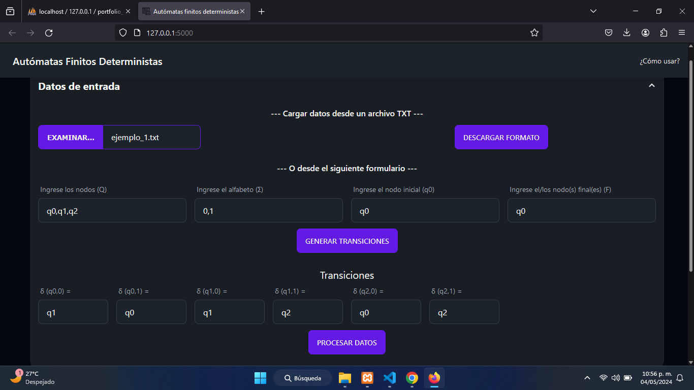
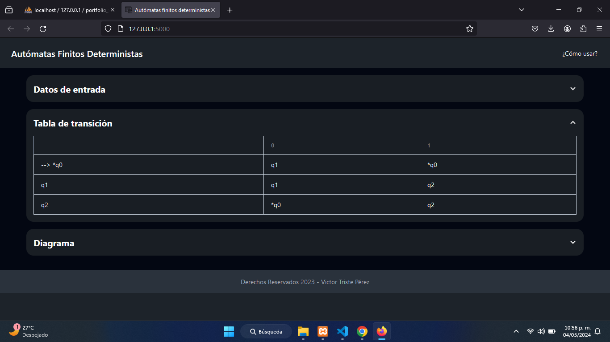
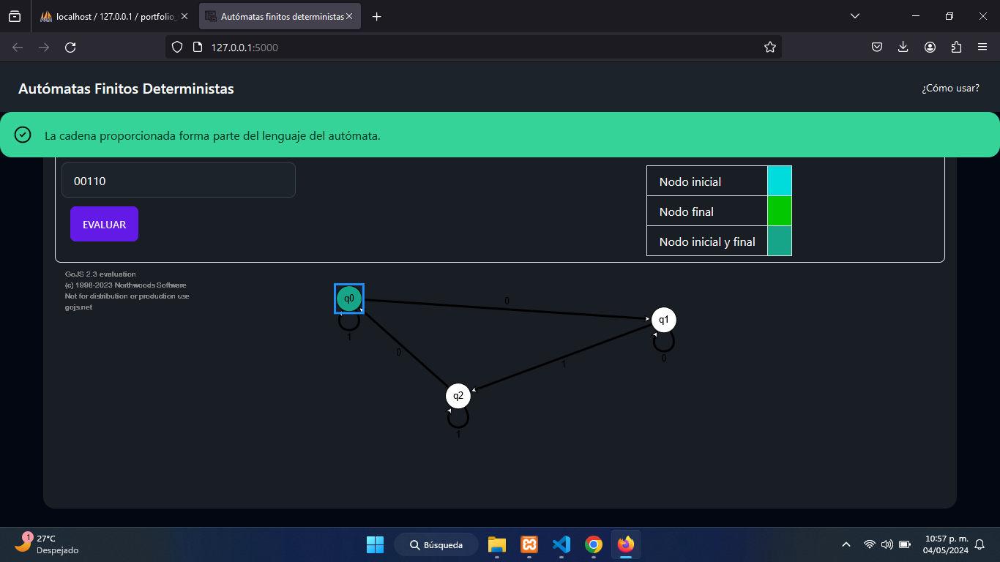

# Autómatas finitos deterministas

#### Realizado por Victor Triste - © Todos los derechos reservados.

### Tecnologías utilizadas:
* HTML5
* JavaScript
* Python
* TailwindCSS
* Flask

## Instrucciones para ejecutar el proyecto
> [!NOTE]
> Es importante posicionarse en la ruta raíz del proyecto antes de ejecutar los siguientes comandos.
1. Instalar las dependencias node con el comando `npm install`
2. Crear un entorno virtual con el comando `Python -m venv .venv`
3. Activar entorno virtual con el comando `.venv\Scripts\activate`
4. Instalar dependencias Python con el comando `pip install -r "requeriments.txt"`
5. Ejecutar la app con el comando `python /src/main.py`

### Capturas de pantalla:

